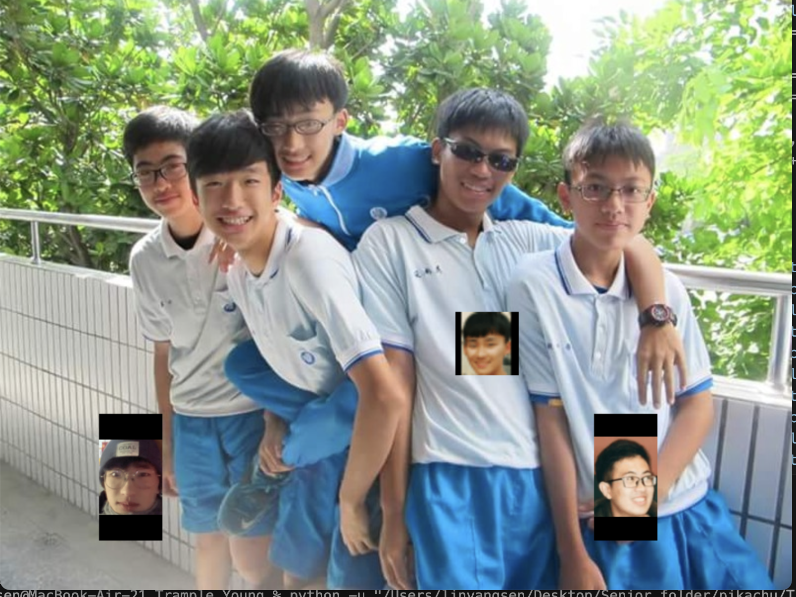

# Trample_Young
### Creators: **Liam Lin** and **James Tu**
Welcome to **Trample Young**, an exciting 2D action game built with Python and Pygame. Dive into a dynamic environment where quick reflexes and strategic movement are key to overcoming challenges and outplaying your opponent.



## Table of Contents

- [Features](#features)
- [Installation](#installation)
- [Gameplay Controls](#gameplay-controls)
- [How to Play](#how-to-play)
- [Assets](#assets)
- [Contributing](#contributing)
- [License](#license)
- [Acknowledgments](#acknowledgments)

---

## Features

- **Engaging Multiplayer Gameplay:** Compete against a friend on the same machine.
- **Simple Controls:** Easy to learn, hard to master mechanics.
- **Basic Physics Simulation:** Realistic movement and collision detection.
- **Customizable Assets:** Modify characters and backgrounds to your liking.

---

## Installation

### Prerequisites

- **Python 3.x** installed on your system.
- **Pygame** library. If not installed, run:

  ```bash
  pip install pygame
  ```

### Setup Instructions

1. **Clone or Download the Repository**

   ```bash
   git clone https://github.com/yourusername/trample-young.git
   ```

2. **Navigate to the Game Directory**

   ```bash
   cd trample-young
   ```

3. **Run the Game**

   ```bash
   python main.py
   ```

---

## Gameplay Controls

### **Player 1**

- **Move Left:** `A` key
- **Move Right:** `D` key
- **Jump:** `W` key

### **Player 2**

- **Move Left:** Left Arrow key
- **Move Right:** Right Arrow key
- **Jump:** Up Arrow key

---

## How to Play

- **Objective:** Outsmart and outmaneuver your opponent by mastering movement and timing.
- **Movement:** Use the controls to navigate the environment and avoid obstacles.
- **Strategy:** Anticipate your opponent's moves and position yourself advantageously.

---

## Assets

- **Characters:** Two distinct player avatars (`player1.png` and `player2.png`).
- **Environment:**
  - **Background (`background.png`):** Sets the stage for the action.
  - **Interactive Elements:** Objects within the game that respond to player actions.
- **Ball (`ball.png`):** Central to the gameplay mechanics.

*Note:* All assets are located in the `assets/` directory. Feel free to customize them to personalize your gaming experience.

---

## Contributing

Contributions are welcome! To contribute:

1. **Fork the Repository**
2. **Create a Feature Branch**

   ```bash
   git checkout -b feature/YourFeature
   ```

3. **Commit Your Changes**

   ```bash
   git commit -m "Add Your Feature"
   ```

4. **Push to the Branch**

   ```bash
   git push origin feature/YourFeature
   ```

5. **Open a Pull Request**

---

## License

This project is licensed under the MIT License. See the [LICENSE](LICENSE) file for details.

---

## Acknowledgments

- **Pygame Community:** For providing resources and support for game development.
- **Python Software Foundation:** For making programming accessible and enjoyable.

---

Enjoy the game! If you encounter any issues or have suggestions, please open an issue on GitHub or contact the developer.